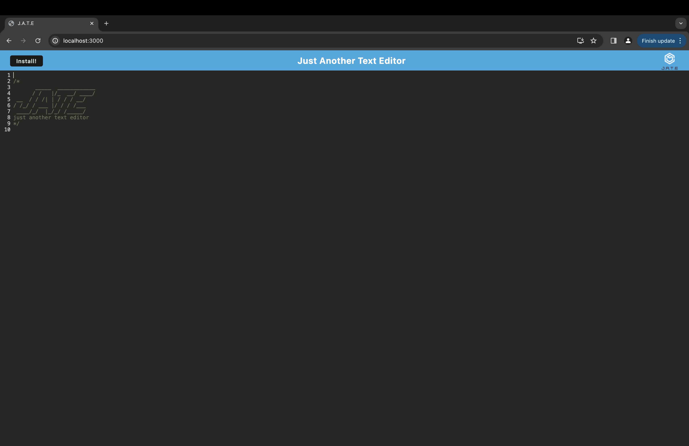

## PWA Text Editor


This is a text editor that runs in the browser. It is a single-page application that meets the PWA criteria. 
Additionally, it features a number of data persistence techniques that serve as redundancy in case one of the options is not supported by the browser. The application also functions offline.

## User Story

```md
AS A developer
I WANT to create notes or code snippets with or without an internet connection
SO THAT I can reliably retrieve them for later use
```

## Instalation 

Navigate to the root directory from your terminal and run 'npm install'.

## Usage

once you run npm install, you can start up the application by 'npm run start'


## This is a priew of my application


 
